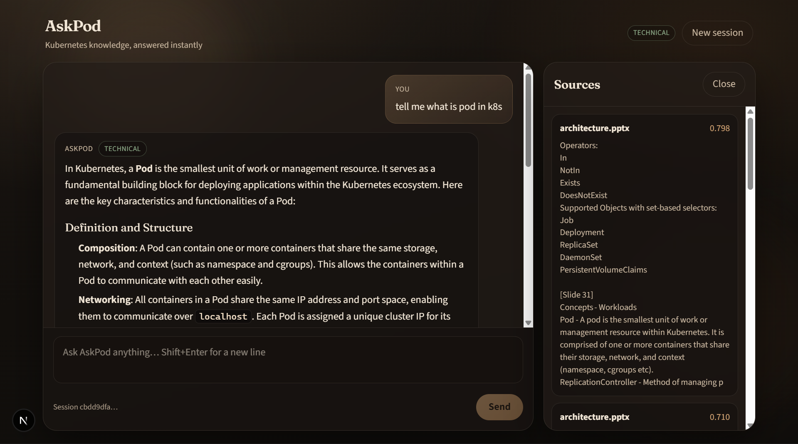
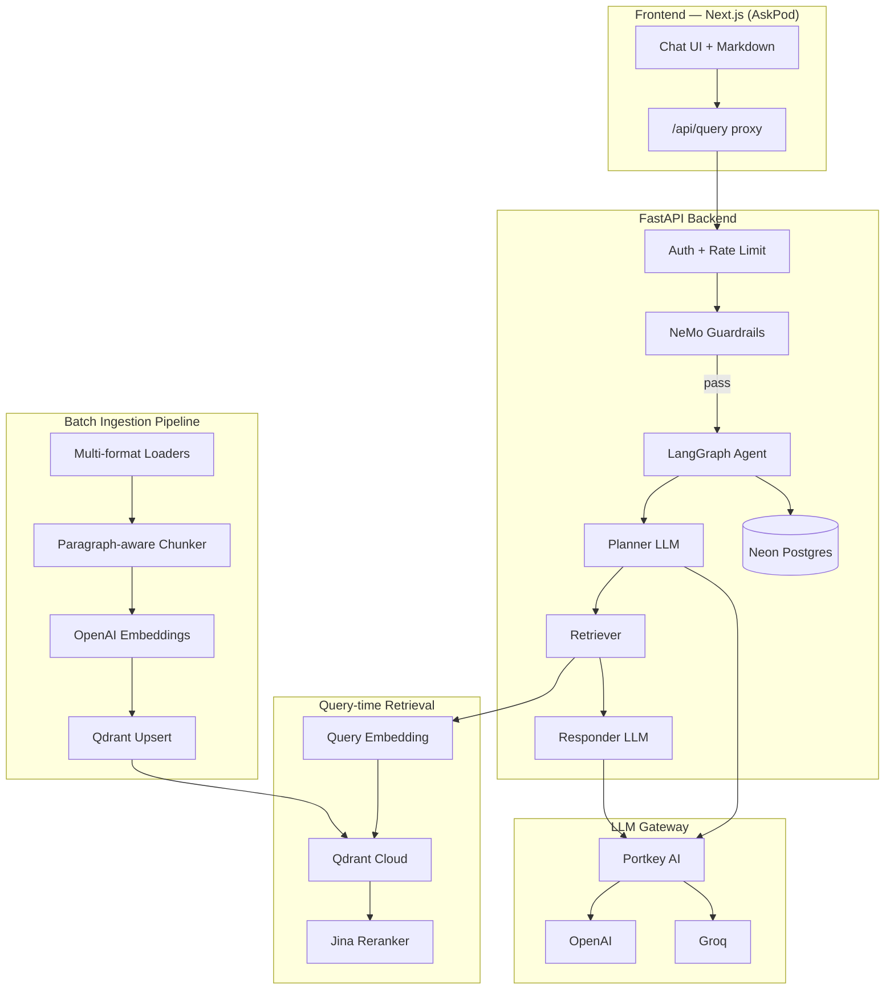

# AskPod

**A production-grade Retrieval-Augmented Generation (RAG) system — built as a personal learning project to understand how real enterprise AI systems are designed, not how tutorial demos pretend they work.**

AskPod is an end-to-end RAG platform over messy enterprise documents (Kubernetes ops guides, HTML exports, Office files, noisy PDFs). It combines **agentic routing**, **two-stage retrieval**, **LLM gateway fault tolerance**, **NeMo guardrails**, **session memory**, **measurable evals**, and a **Next.js chat UI** — the same class of concerns you see in production AI backends, implemented deliberately layer by layer.

> **Current phase:** Batch ingestion → static vectors in Qdrant → query-time retrieval.  
> **Next phase:** Real-time RAG with **Change Data Capture (CDC)** so document updates propagate to the vector index without full re-ingest.

<p align="center">
  
</p>
<p align="center"><em>AskPod UI — technical queries with formatted answers, intent routing, and retrieved sources.</em></p>

---

## Author

**Mirza Shahbaz Ali Baig**  
Backend & AI systems — building this in public to master production RAG fundamentals before moving to streaming ingestion.

---

## Why this is not "just another RAG tutorial"

Most RAG repos do three things: chunk a PDF, stuff context into a prompt, return an answer. That is useful for learning embeddings, but it is not how teams ship.

AskPod is designed around problems that show up **after** the hello-world:

| Tutorial RAG | AskPod (production-minded) |
|--------------|----------------------------|
| Single clean PDF | Multi-format loaders + **clean vs noisy corpora** |
| One retrieve → generate hop | **LangGraph agent**: planner → retriever → responder |
| Same model for everything | **Embed ≠ chat ≠ judge** — separate providers & keys |
| Vector search only | **Qdrant (15 candidates) → Jina rerank (top 5)** |
| No safety layer | **NeMo Guardrails** (input, dialog, output, PII, jailbreak) |
| No gateway | **Portkey** — VK routing, fallback, cache, cost metadata |
| "Looks fine to me" | **RAGAS suite** + guardrail confusion matrix + Streamlit monitor |
| No auth / limits | **Bearer API key**, optional JWT, **Upstash rate limiting** |
| Chat amnesia | **Neon Postgres** session memory (messages only, not bloated checkpoints) |
| Blind in prod | **Logfire** + **Langfuse** tracing on agent & ingestion spans |

The goal of this repo is **understanding**: every folder maps to a real production concern you would defend in a design review.

---

## Architecture



### Query path (one turn)

1. **Input guardrails** — NeMo Colang (greetings, jailbreak, PII, off-topic) run *before* the agent graph.
2. **Planner** — History-aware LLM decides: conversational reply **or** technical rewrite for search (XOR contract, structured JSON).
3. **Retriever** (technical only) — Embed query → Qdrant vector search (15) → Jina rerank (5).
4. **Responder** — Architect-grade answer grounded in retrieved chunks (Markdown output).
5. **Output guardrails** — Mask / block unsafe final answers.
6. **Persist** — Append user + assistant messages to Neon (`session_id`); docs/plan/scores are ephemeral per turn.

### Ingestion path (batch — no CDC yet)

```
load → chunk (~1200 chars, 150 overlap) → embed (OpenAI batch 50) → upsert Qdrant
```

Document vectors are **static** until you re-run ingestion. Query-time embedding only vectorizes the **user question**.

---

## Technology stack

### Core backend
| Layer | Technology |
|-------|------------|
| Runtime | Python 3.11+, **uv** package manager |
| API | **FastAPI**, **Uvicorn** |
| Config | **Pydantic Settings** (`.env`) |
| Agent orchestration | **LangGraph** + **LangChain** |
| Vector DB | **Qdrant Cloud** (cosine, 1536-dim) |
| Embeddings | **OpenAI** `text-embedding-3-small` |
| Chat inference | **OpenAI** / **Groq** via **Portkey** gateway |
| Reranking | **Jina AI** `jina-reranker-v2-base-multilingual` |
| Session store | **Neon Postgres** (`psycopg`) |
| Safety | **NeMo Guardrails** (Colang 1.x, FastEmbed, Presidio-ready PII) |
| LLM gateway | **Portkey** — virtual keys, fallback, cache, retries, metadata |
| Observability | **Pydantic Logfire**, **Langfuse** |
| Rate limiting | **Upstash Redis** REST (in-memory fallback locally) |
| Auth | Bearer `RAG_API_KEY`, optional HS256 JWT |

### Ingestion & retrieval
| Concern | Implementation |
|---------|----------------|
| Text / HTML / PDF / Office | Extension-routed loaders (`pdfplumber` → `pypdf` fallback, `python-docx`, `python-pptx`, BeautifulSoup + lxml) |
| Chunking | Custom paragraph-aware splitter (~1200 chars, 150 overlap, sentence split for long paragraphs) |
| Embedding resilience | Batch 50, 4 retries with exponential backoff; local `sentence-transformers` fallback on ingest failure |
| Stable point IDs | UUID5 per `(source, chunk_index)` — re-ingest overwrites, no duplicates |
| Retrieval | Wider candidate pull → cross-encoder rerank before LLM context |

### Frontend (`web/`)
| Layer | Technology |
|-------|------------|
| Framework | **Next.js 16** (App Router), **React 19**, **TypeScript** |
| Styling | **Tailwind CSS 4**, custom dark theme |
| Markdown | **react-markdown** + **remark-gfm** |
| API | Server-side `/api/query` proxy (API key never in browser) |

### Evaluation & ops
| Tool | Purpose |
|------|---------|
| **RAGAS** | Faithfulness, Answer Relevancy, Context Precision/Recall, Answer Correctness |
| Golden dataset | 15 K8s/RAG Q&A + 6 guardrail cases |
| Tool correctness | Expected vs actual retriever use (Jaccard, zero judge cost) |
| Guardrail matrix | TP/TN/FP/FN on `should_block` |
| **Streamlit** | `evals_ui/` — local eval monitor dashboard |

---

## Repository layout

```
Enterprise_RAG/
├── app/                          # FastAPI backend
│   ├── main.py                   # /, /health, /ready, /query, /sessions
│   ├── config.py                 # Central settings
│   ├── warmup.py                 # Startup: graph + NeMo preload
│   ├── agents/                   # LangGraph planner → retriever → responder
│   ├── db/session_store.py       # Neon chat memory (messages only)
│   ├── gateway/portkey_client.py # Portkey headers, VK, cache config
│   ├── guardrails/               # NeMo engine + Colang config
│   ├── ingestion/                # loaders, chunking, processor CLI
│   ├── services/retrieval/       # embeddings, Qdrant, Jina rerank
│   ├── security/                 # auth + rate limit
│   ├── observability/            # Langfuse tracing
│   └── scripts/                  # Smoke tests (guardrails, portkey, agent, …)
├── web/                          # AskPod Next.js UI
├── evals/                        # RAGAS + golden dataset + pipeline
├── evals_ui/                     # Streamlit eval monitor
├── DATA/true_data/               # Curated corpus
├── DATA/noisy_data/              # Messy real-world corpus
├── processed_data/               # Ingestion artifacts
├── pyproject.toml                # uv dependencies
├── Dockerfile
└── .env.example
```

---

## Production patterns implemented

### 1. Agentic routing (not naive RAG)
The planner enforces a strict **XOR contract**: either a conversational reply *or* a rewritten search query — never both. Follow-ups like *"how do I monitor it?"* are rewritten with explicit entities (*"how to monitor Kubernetes DaemonSet"*) using up to 12 turns of history.

### 2. Two-stage retrieval
Vector search casts a wide net (15 chunks); **Jina reranker** re-orders by query relevance before the LLM sees context. This is the standard production pattern when bi-encoder recall ≠ cross-encoder precision.

### 3. LLM gateway (Portkey)
- Primary / fallback virtual keys (OpenAI ↔ Groq)
- Saved Config ID (`pc-...`) when org blocks inline JSON
- Simple / semantic response cache
- Per-request metadata: `route`, `feature`, `environment`, `user_id`
- Runtime fallback to direct provider if Portkey blocks inline config

### 4. Guardrails as a gate, not an afterthought
NeMo runs **before** and **after** the agent:
- Input: jailbreak, PII, off-topic, dialog flows (FastEmbed + LLM intent confirm)
- Output: block / mask unsafe answers
- Fail-closed by default (`GUARDRAILS_FAIL_OPEN=false`)
- Startup warmup loads NeMo + FastEmbed so first user query is not a 4-minute cold start

### 5. Session memory without checkpoint bloat
LangGraph runs **stateless** per request. Only `user` / `assistant` text is stored in Neon — not full `AgentState` (documents, plans, scores). In-memory fallback if Neon is unreachable so `/query` still works.

### 6. API hardening
- `RAG_API_KEY` / JWT on `/query` and `/sessions*` (when not in debug)
- Upstash Redis rate limit (`RATE_LIMIT_PER_MINUTE`) with local fallback
- CORS allowlist for Next.js origins
- Next.js server proxy keeps secrets off the client

### 7. Measurable quality (RAGAS)
Not vibe-based QA — a runnable eval suite with persisted reports in `evals/results/`.

---

## Quick start

### Prerequisites
- Python 3.11+, [uv](https://docs.astral.sh/uv/)
- Node.js 20+ (for `web/`)
- Accounts: OpenAI, Qdrant Cloud, (optional) Groq, Jina, Portkey, Neon, Upstash

### 1. Clone & configure
```bash
git clone https://github.com/<your-username>/Enterprise_RAG.git
cd Enterprise_RAG
cp .env.example .env
# Fill: OPENAI_API_KEY, QDRANT_*, GROQ_* or USE_OPENAI_LLM=true, JINA_API_KEY, DATABASE_URL, …
```

### 2. Install & run backend
```bash
uv sync
uv run python -m uvicorn app.main:app --reload --host 127.0.0.1 --port 8000
```

- API docs: http://127.0.0.1:8000/docs  
- Health: http://127.0.0.1:8000/ready  
- Startup warmup (`WARMUP_ON_STARTUP=true`) pre-loads guardrails + agent graph

### 3. Ingest documents
```bash
# Single file
uv run python -m app.ingestion.processor --file DATA/true_data/parallel_work_queue.txt --corpus true

# Entire curated folder
uv run python -m app.ingestion.processor --dir DATA/true_data --corpus true

# Both corpora
uv run python -m app.ingestion.processor --universal

# Dry run (no Qdrant write)
uv run python -m app.ingestion.processor --file DATA/true_data/cronjobs.docx --no-upsert
```

### 4. Run AskPod UI
```bash
cd web
cp .env.local.example .env.local   # RAG_BACKEND_URL=http://127.0.0.1:8000
npm install
npm run dev
```

Open http://localhost:3000 — chat proxies through Next.js `/api/query` (never expose `RAG_API_KEY` in the browser).

### 5. Chat API (curl)
```bash
curl -X POST http://127.0.0.1:8000/query \
  -H "Content-Type: application/json" \
  -d '{"question":"How do Jobs use a work queue?","session_id":"YOUR-UUID"}'
```

---

## Evaluation

```bash
# Terminal A — API running
uv run python -m uvicorn app.main:app --host 127.0.0.1 --port 8000

# Terminal B — full suite
uv run python -m evals

# Or step by step
uv run python -m evals.pipeline --limit 5
uv run python -m evals.metrics
uv run python -m evals.guardrails_eval

# Guardrails unit tests (no live API)
uv run python -m app.scripts.test_guardrails
```

**Streamlit monitor:** `uv run streamlit run eval_monitor.py` → http://localhost:8501

| Metric | What it measures |
|--------|------------------|
| Faithfulness | Claims supported by retrieved context (hallucination) |
| Answer Relevancy | Answer addresses the question |
| Context Precision / Recall | Right chunks retrieved & ranked |
| Answer Correctness | Overlap + semantic match vs reference |
| Tool correctness | Planner routed to retriever when expected |
| Guardrail matrix | TP/TN/FP/FN on blocked inputs |

---

## Configuration reference

Key environment variables (see `.env.example` for full list):

| Variable | Purpose |
|----------|---------|
| `APP_NAME` | Service name (`AskPod`) |
| `OPENAI_API_KEY` | Embeddings (+ optional chat) |
| `USE_OPENAI_LLM` | `true` = OpenAI for guardrails/judge; `false` = Groq |
| `GROQ_API_KEY` | Fast inference / Portkey fallback |
| `PORTKEY_API_KEY` + `PORTKEY_CONFIG_ID` | LLM gateway |
| `JINA_API_KEY` | Reranker |
| `QDRANT_CLUSTER_ENDPOINT` + `QDRANT_API_KEY` + `QDRANT_COLLECTION` | Vector store |
| `DATABASE_URL` | Neon session memory |
| `GUARDRAILS_ENABLED` | NeMo rails on/off |
| `WARMUP_ON_STARTUP` | Pre-load guardrails at boot |
| `RAG_API_KEY` | Protect `/query` in production |
| `UPSTASH_REDIS_REST_*` | Distributed rate limiting |

---

## Roadmap: real-time RAG with CDC

This project intentionally ships **batch ingest first** — the same maturity order most teams follow before adding streaming complexity.

| Phase | Status | Description |
|-------|--------|-------------|
| **1. Batch RAG** | ✅ Current | Load → chunk → embed → Qdrant; static index; agentic query path |
| **2. Eval & safety** | ✅ Done | RAGAS, guardrails matrix, Portkey gateway, auth, rate limits |
| **3. Real-time ingest (CDC)** | 🔜 Next | Propagate document create/update/delete to Qdrant without full re-ingest |
| **4. Streaming answers** | Planned | Token streaming from responder to AskPod UI |
| **5. Hybrid retrieval** | Planned | Metadata filters, corpus routing, optional sparse + dense |

### What CDC will add
- **Change detection** — watch `DATA/`, S3, Confluence, or Postgres logical replication for doc changes
- **Incremental upsert/delete** — stable UUID5 point IDs already support overwrite; add tombstone deletes on doc removal
- **Near-real-time index freshness** — minutes, not nightly batch jobs
- **Eval regression on drift** — re-run golden set when corpus version changes

---

## Smoke tests & scripts

```bash
uv run python -m app.scripts.smoke_loaders          # Document loaders
uv run python -m app.scripts.test_retriever_node    # Qdrant + Jina path
uv run python -m app.scripts.test_plan_xor          # Planner XOR contract
uv run python -m app.scripts.test_portkey --live    # Portkey gateway
uv run python -m app.scripts.print_portkey_config   # Dashboard Config JSON
uv run python -m app.scripts.test_neon_sessions     # Session memory
uv run python -m app.scripts.test_agent_graph       # End-to-end agent
```

---

## Docker

```bash
docker build -t askpod-api .
docker run -p 8000:8000 --env-file .env askpod-api
```

---

## What I learned building this

- **RAG quality is an ingestion problem first** — loaders, chunk boundaries, and corpus hygiene matter more than prompt tweaking.
- **Retrieval is two problems** — recall (embeddings + Qdrant) and precision (reranker before LLM).
- **Agents need contracts** — planner XOR schema prevents mixed conversational + retrieval paths.
- **Safety and evals are not optional** — guardrails + RAGAS turn "demo" into something you can ship and measure.
- **Gateways exist for a reason** — provider fallback, cache, and cost attribution belong outside application code.
- **Memory design matters** — persist chat text, not full agent state snapshots.

---

## License & contact

Personal portfolio / learning project.  
**Mirza Shahbaz Ali Baig** — [mirzashahbazbaig724@gmail.com](mailto:mirzashahbazbaig724@gmail.com)

If this repo helps you think about production RAG differently, consider starring it — and watch the commits as CDC lands next.
